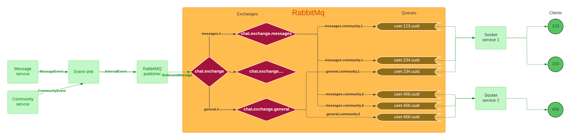

# Events core
This module serves purpose of emitting events for end user from all services.

## 1. How to create new event
Each event has to implement `InternalEvent` interface. For example:
```
@Getter
@Builder
public class MessageCreateEvent implements InternalEvent<MessageDTO> {
    private final String name = "MESSAGE_CREATE_EVENT";
    private final EventType type = EventType.MESSAGES;

    private final Recipient recipient;
    private final MessageDTO data;
}
```
In this example methods required by `InternalEvent` interface are provided by lombok's `@Getter`.
When doing so, it's important to keep variable name identical to interface's method, 
e.g. `getName()` means that we have to define variable `name`.

Check `InternalEvent` documentation for information about what those methods are.
In short:
- `name` - unique id of event, preferably with uppercase letters and underscore instead of space
- `type` - which exchange (RabbitMQ) this event will be published to. In socket module, end user can subscribe to only those events, which they choose.
- `recipient` - Could be either user or community, that means that messages can be pushed to one user or entire community.
- `data` - payload of event - data that will be sent to end user

Later, when sending events to end user, `type` and `recipient` is stripped from InternalEvent.

Thanks to `@Builder`, event can be defined like this:
```
MessageCreateEvent.builder()
    .data(message)
    .recipient(Recipient.builder()
            .context(Recipient.Context.COMMUNITY)
            .id(channel.getCommunityId())
            .build())
    .build()
```


## 2. How event publishing works
Events can be published to internal event sink by:
```
eventSinkService.publish(event);
```
From there user (programmer) can listen to events using `asFlux` method.
Example where only events of class `MessageCreateEvent`, are acquired:
```
eventSinkService.asFlux()
.ofType(MessageCreateEvent.class)
.flatMap(event -> ...)
.subscribe();
```

To actually publish events to RabbitMq, `RabbitMqPublisher` component is used.
It is configured with `RabbitMqConfiguration` and `RabbitMqProperties`.
Except for configuration in those classes, user doesn't have to do anything to publish events,
as `RabbitMqPublisher` takes all events from `EventSinkService`, converts them to appropriate message 
and sends finally sends them to main exchange (explained later).

## 3. RabbitMQ
RabbitMq uses exchanges and queues to deliver messages to clients.

**Exchanges** can also be understood as routers, as they route messages based on **routing key** (thanks to binding), to other exchanges, or queues.

**Binding** is a connection between queue and/or exchange. It uses **routing key** to route messages based on rule defined in them (`messages.#`, `message.community.*`).

**Queue** is a FIFO collection, where each message can be consumed only by one of many consumers.




In this diagram, **client** is a rsocket requester (android application or user of website)

### Why each client has their own queues?
Two consumers cannot read the same message, this means that each consumer will receive only part of all messages in queue.

### Why multiple queues per client?
If there was just one queue, **Socket service** would have to filter messages from that queue based on *type* of given event
and then pass that event to correct stream request, e.g. `/community/1/messages`.
It makes RabbitMQ node to use more resources, but in this way socket service is less convoluted and doesn't take away the job of broker service (routing of messages).


For information about receiving messages from rabbitmq, check documentation in socket module.