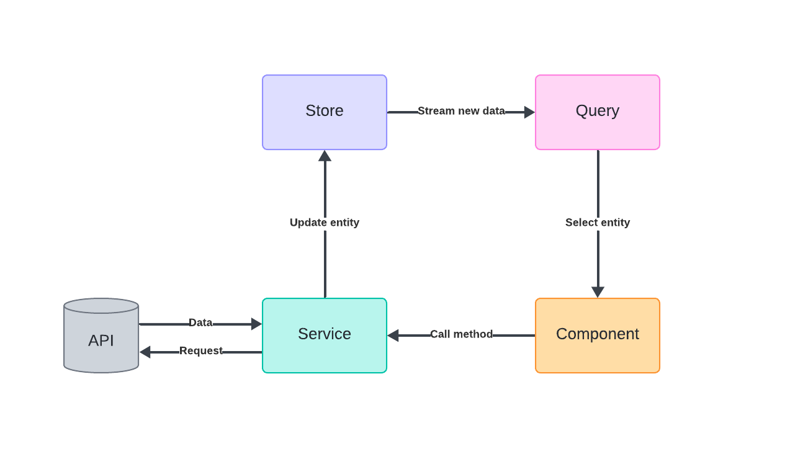

# State management

A lot of data fetched from API can be cached in an Angular app.
Some entities, like Users and Communities, only change when the current client
performs an action, so there’s no chance of server-side mutations.
Other entities, such as Channels and Roles, change rarely,
and updates can be handled via RabbitMQ.
Messages, however, cannot be cached efficiently.

## 1. App data flow



The base Angular app is built using components and services.
Components are responsible for the UI and local state,
while services manage logic separate from the UI,
such as data fetching and handling global state.
Although it’s possible to manage data flow this way,
to improve development speed and simplify state management,
this project uses the **Akita** library,
which provides `EntityStore` and `EntityQuery` interfaces.
All cached data is stored in a normalized form,
with each entity having its own store.

## 2. Store

```angular17html
export interface CommunityState extends EntityState<Community, string>, ActiveState {}

@Injectable({ providedIn: 'root' })
@StoreConfig({name: 'community'})
export class CommunityStore extends EntityStore<CommunityState> {

  constructor() {
  super();
  }
}
```

By extending `EntityState`, we gain an interface that helps implement the `EntityStore` class.
The store holds a flat collection of data, similar to a table in a relational database.
It provides methods to update entity states, such as `set()`, `add()`, or `remove()`.
The `ActiveState` interface is used to track the active entity,
making it easier to interact with entities like the currently active community or channel.

## 3. Query

```angular17html
@Injectable({ providedIn: 'root' })
export class CommunityQuery extends QueryEntity<CommunityState> {

  constructor(protected override store: CommunityStore) {
  super(store);
  }
}
```
Implementing the `Query` interface allows you to query a specific entity's store.
It simplifies data retrieval through methods like `selectAll()`, `selectFirst()`, `selectCount()`, 
or `selectActive()`. These methods return streams of data that automatically update
as the store changes, allowing components to reactively re-render.
It also offers `get` methods, such as `getActiveId()`,
which return raw values for more immediate data access.

## 4. Usage
Both `Store` and `Query` can be injected into components or service via dependency injection.

### Using store

Once the store is injected into a service,
it can be used to store data fetched from the API.

```
createCommunity(form: {name: string}) {
  this.http.post<Community>(this.apiPath, {name: form.name}).subscribe(
    community => this.communityStore.add(community)
  );
}
```

### Using query

When the query is injected into a component,
it provides streams of reactive data.
These streams can be stored as `Observables` and used with the `async pipe`,
or subscribed to directly, with a function executed on the emitted values.

```
this.communityQuery.selectActive().subscribe(community => {
  this.selectedCommunity = community;
});
```
